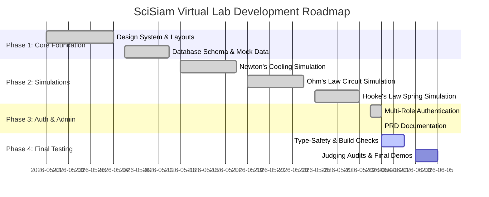

> Historical prototype PRD. Superseded by [the active PRD](../PRD.md); it documents an earlier localStorage, scoring, and 36-lab product model.

# Product Requirement Document (PRD)
## โครงการ: SciSiam Virtual Lab (วิทยาศาสตร์เสมือนจริงสำหรับนักเรียนไทย)

---

## 1. Executive Summary (บทสรุปผู้บริหาร)
**SciSiam Virtual Lab** คือแพลตฟอร์มจำลองการทดลองวิทยาศาสตร์เสมือนจริงบนเว็บ (Virtual Science Lab Web Application) ที่พัฒนาขึ้นสำหรับนักเรียนและคุณครูในประเทศไทย มีจุดประสงค์เพื่อลดช่องว่างในการเข้าถึงอุปกรณ์ห้องแล็บวิทยาศาสตร์ที่มีราคาแพง โดยเปิดโอกาสให้ผู้เรียนสามารถตั้งสมมติฐาน ปรับเปลี่ยนตัวแปร ดูผลกระทบทางกายภาพผ่านภาพกราฟิก SVG แบบเรียลไทม์ เก็บบันทึกข้อมูลตัวเลขทดลองลงตาราง วาดกราฟเปรียบเทียบ และปรึกษา **SciSiam AI Tutor** (ระบบผู้ช่วยสอนส่วนตัว) ได้ตลอด 24 ชั่วโมง

### 1.1 Product Vision & Goals
* **ความง่ายในการเรียนรู้ (Self-Paced Learning)**: ผู้เรียนสามารถทำการทดลองที่อาจเป็นอันตรายหรือใช้อุปกรณ์ซับซ้อนได้ด้วยตัวเองแบบปลอดภัย
* **การใช้งานได้จากทุกที่ (Accessibility)**: รองรับการเข้าถึงผ่าน Web browser ทั้งบนคอมพิวเตอร์ (PC) และมือถือ (Mobile Responsive)
* **ความเสมือนจริงและน่าเชื่อถือ (High Fidelity & Educational Value)**: แสดงกราฟิกจำลองการเปลี่ยนรูปพลังงานและตัวแปรสอดคล้องตามกฎฟิสิกส์ เคมี และชีววิทยาอย่างถูกต้อง
* **ความพร้อมสำหรับการประกวด (Competition Readiness)**: มีความสมบูรณ์ในการทำงาน (Full-flow Interactive) ไม่มีลิงก์เสียหรือหน้าว่าง และปรับแต่งมาเพื่อประสิทธิภาพสูงสุด

---

## 2. User Roles & Personas (บทบาทผู้ใช้งาน)

ระบบแบ่งผู้ใช้งานออกเป็น 2 บทบาทหลัก โดยแต่ละบทบาทจะมีโฟลว์การใช้งานและความต้องการที่ต่างกัน:

| บทบาท (Roles) | ความต้องการหลัก (Needs) | พฤติกรรมในระบบ (Actions) |
| :--- | :--- | :--- |
| **นักเรียน (Student)** | - ต้องการทำการทดลองเพื่อทำความเข้าใจบทเรียนเรียน - ต้องการความสนุกสนานและแต้มแรงจูงใจ (Gamification) - ต้องการคำใบ้เมื่อหาผลการทดลองไม่ได้ | - ค้นหาห้องแล็บตามหัวข้อ - ปรับตัวแปรทดลอง บันทึกตาราง และเซฟผล - ถาม AI Tutor เกี่ยวกับสูตรและกราฟ - สะสมแต้มแต้มภารกิจและอัปเลเวลในหน้า Profile |
| **คุณครู (Teacher)** | - ต้องการเครื่องมือสาธิตการสอนในชั้นเรียน - ต้องการติดตามการทดลองของนักเรียน - ต้องการสร้างโจทย์หรือควบคุมทิศทางกิจกรรม | - เข้าสู่ระบบในฐานะผู้ดูแลระบบห้องแล็บ - ใช้หน้าจอสตรีมการทดลองเพื่อขึ้นโปรเจกเตอร์ - เข้าถึงหน้ารายละเอียดและปรับแก้ชื่อโปรไฟล์ผู้ควบคุม |

---

## 3. Functional Requirements (ความต้องการระบบเชิงฟังก์ชัน)

### 3.1 Interactive Dashboard (หน้าแรกและระบบค้นหา)
* **ระบบจัดหมวดหมู่ (Category Filter)**: จัดกลุ่มห้องแล็บออกเป็น 3 สาขาวิชาหลัก ได้แก่:
  * **ฟิสิกส์ (Physics)** (เช่น กฎการเย็นตัวของนิวตัน, กฎของโอห์ม, กฎของฮุก)
  * **เคมี (Chemistry)** (เช่น การไทเทรตกรด-เบส, สมดุลเคมี)
  * **ชีววิทยา (Biology)** (เช่น การแบ่งเซลล์แบบไมโทซิส, พันธุศาสตร์เมนเดล)
* **ระบบค้นหาด่วน (Search Bar)**: ค้นหาชื่อแล็บ คีย์เวิร์ด หรือหัวข้อวิชาได้แบบเรียลไทม์ พร้อมตัวแสดงสถานะพร้อมใช้งาน (Ready / In Development) ป้องกันการสับสน
* **ระบบ Sidebar Navigation**: เมนูด้านข้างที่ยืดหดได้สำหรับนำทางไปยังหน้าหลัก, ตารางทดลอง, ข้อมูลโปรไฟล์ และช่วยเหลือ

### 3.2 Multi-Role Authentication (ระบบเข้าสู่ระบบและสมัครสมาชิก)
* **โหมดสมัครสมาชิก (Register)**:
  * กรอกข้อมูล ชื่อ-นามสกุล, อีเมล, รหัสผ่าน, และยืนยันรหัสผ่าน
  * ระบบตรวจสอบความปลอดภัยรหัสผ่านแบบเรียลไทม์ (อย่างน้อย 8 ตัวอักษร, มีตัวพิมพ์ใหญ่/ตัวเลข) แสดงสัญลักษณ์ติ๊กถูกสีเขียวเมื่อผ่านเกณฑ์
  * การเลือกบทบาท (ระดับชั้น / บทบาท): **นักเรียน** หรือ **คุณครู** ผ่าน Dropdown รายการเลือก
  * ช่องยอมรับเงื่อนไขการใช้งานและนโยบายความเป็นส่วนตัว
  * **ข้อห้าม**: ไม่มีปุ่มผูกบัญชี Google (No Google OAuth Button) และไม่มีแบนเนอร์ข้อความแจ้งความปลอดภัยระบบออนไลน์
* **โหมดเข้าสู่ระบบ (Login)**:
  * กรอกข้อมูล อีเมล, รหัสผ่าน และการเลือกบทบาท
  * แสดงข้อความเตือน (Error Message) หากกรอกข้อมูลไม่ถูกต้อง
* **การทำงานของระบบหลังบ้านจำลอง (Mock Session Sync)**:
  * เมื่อล็อกอินหรือสมัครสมาชิกสำเร็จ ข้อมูลจะถูกเก็บลง `localStorage` ได้แก่ `scisiam_logged_in`, `scisiam_user_role`, `scisiam_user_name`, `scisiam_user_email` และ `scisiam_points`
  * การส่ง Event แจ้งไปยัง `Navbar.tsx` เพื่อเปลี่ยนปุ่ม "เข้าสู่ระบบ" เป็นรูปภาพโปรไฟล์พร้อมคำต้อนรับ (เช่น *สวัสดี, คุณครู* หรือ *สวัสดี, [ชื่อนักเรียน]*) ทันทีโดยไม่ต้องโหลดหน้าเว็บใหม่ (Dynamic Re-render)
  * เมื่อกดออกจากระบบ (Logout) จะเคลียร์ข้อมูลจาก `localStorage` และนำผู้ใช้กลับสู่หน้าหลัก

### 3.3 Lab Manual & Theory Explorer (คู่มือความรู้รายละเอียดการทดลอง)
* **แผงความรู้ก่อนเรียน**: ประกอบด้วย:
  * **การเรียนรู้เชิงทฤษฎี (Theory Card)**: แสดงสูตร สมการที่เกี่ยวข้อง (เช่น $V = I \times R$ หรือ $F = -k \times x$) พร้อมอธิบายตัวแปรอย่างชัดเจน
  * **รายการอุปกรณ์ (Equipment List)**: แสดงรูปการ์ดอุปกรณ์ที่ต้องใช้จำลอง (เช่น แหล่งจ่ายไฟกระแสตรง, สปริง, บีกเกอร์)
  * **ขั้นตอนการทดลอง (Experiment Steps)**: แสดงรายการขั้นตอน 1, 2, 3, 4 เพื่อแนะแนวทางให้นักเรียนปฏิบัติได้อย่างเป็นระบบ
* **การป้องกัน Newton Cooling Fallback**: ปรับปรุงหน้าข้อมูลให้เป็นแบบไดนามิกตามรหัสห้องแล็บ (`labId`) โดยข้อมูลและสูตรของฟิสิกส์ เคมี ชีววิทยา จะต้องปรับเปลี่ยนตรงตามแล็บนั้นๆ อย่างถูกต้อง

### 3.4 Lab Simulation Chambers (ห้องปฏิบัติการจำลองการทดลอง)
เป็นหัวใจสำคัญของผลิตภัณฑ์ ประกอบด้วยห้องทดลองหลัก 3 ห้องที่พัฒนาสมบูรณ์แล้ว:
1. **Newton's Law of Cooling (กฎการเย็นตัวของนิวตัน)**:
   * **ตัวแปรปรับได้**: อุณหภูมิน้ำเริ่มต้น (Initial Water Temp: 40-95°C), อุณหภูมิห้องโดยรอบ (Ambient Temp: 10-35°C), และค่าคงที่การระบายความร้อน (Cooling Constant)
   * **กราฟิกจำลอง**: บีกเกอร์ใส่น้ำบนเตาฮีทเตอร์ไฟฟ้า แสดงฟองเดือด สีของน้ำเปลี่ยนตามอุณหภูมิ (น้ำร้อนเป็นสีส้ม-แดง น้ำเย็นเป็นสีฟ้า) และพัดลมระบายอากาศหมุนตามระดับแรงลม
   * **Quest**: ได้รับแต้มสะสมเมื่ออุณหภูมิน้ำลดลงมาถึงระดับที่กำหนด
2. **Ohm's Law & DC Circuits (กฎของโอห์มและวงจรไฟฟ้ากระแสตรง)**:
   * **ตัวแปรปรับได้**: แรงดันไฟฟ้าของแหล่งจ่าย (Voltage: 0-24V) และความต้านทานของตัวต้านทาน (Resistance: 10-500 Ω)
   * **กราฟิกจำลอง**: แผงวงจรไฟฟ้า แสดงแบตเตอรี่, สวิตช์ปิด/เปิด, ตัวต้านทาน (แถมสีของตัวต้านทานเปลี่ยนจริงตามค่าความต้านทานที่ระบุ!), เครื่องวัดกระแสไฟฟ้า (Ammeter), เครื่องวัดแรงดัน (Voltmeter) และวงกลมอิเล็กตรอนเรืองแสงสีฟ้าเคลื่อนที่เร็วขึ้นตามปริมาณกระแสไฟฟ้า
   * **Quest**: รับแต้มภารกิจเมื่อรักษากระแสไฟฟ้าให้อยู่ในช่วง 0.1A - 0.2A ต่อเนื่องเป็นเวลา 20 วินาที
3. **Hooke's Law of Elasticity (กฎความยืดหยุ่นของฮุก)**:
   * **ตัวแปรปรับได้**: มวลของลูกตุ้มน้ำหนัก (Mass: 50-500g) และค่าความแข็งของสปริง (Spring Constant: 10-50 N/m)
   * **กราฟิกจำลอง**: ขาตั้งไม้แขวนสปริงและลูกตุ้ม แสดงการยืด-หดของสปริงตามน้ำหนักถ่วงและแรงดึงกลับ พร้อมระบบจำลองการสั่นไหวแบบฮาร์มอนิกอย่างง่าย (Simple Harmonic Motion Oscillation)
   * **Quest**: รับแต้มภารกิจเมื่อทำการสั่นสปริงและหยุดนิ่งที่ระยะยืดเป้าหมายที่กำหนดไว้

* **ฟังก์ชันการจัดการตารางและกราฟ**:
  * **ตารางบันทึกผล (Data Logging Table)**: นักเรียนสามารถกดปุ่ม "บันทึกผลการทดลอง" เพื่อบันทึกอุณหภูมิ, กระแสไฟฟ้า, หรือแรงยืด ลงในตารางแบบแมนนวลหรือออโต้ล็อกได้
  * **กราฟแสดงผลแบบเรียลไทม์ (Live SVG Graphs)**: แสดงการวาดเส้นกราฟ (เช่น กระแสไฟฟ้าเทียบแรงดัน หรือ ความยาวสปริงเทียบมวลน้ำหนัก) แบบไดนามิกผ่าน `<svg>` โดยไม่มีการกระตุก
  * **ระบบเคลียร์ข้อมูล (Reset/Clear)**: ปุ่มสำหรับรีเซ็ตหน้าจอจำลองล้างค่ากราฟและลบตารางทั้งหมดเพื่อเริ่มต้นทดลองใหม่

### 3.5 SciSiam AI Tutor (ระบบปัญญาประดิษฐ์ผู้ช่วยสอน)
* **แชทบอทด้านข้างห้องแล็บ**: แถบสนทนาขวาของหน้าทดลองจำลองที่ดึงบริบทของตัวแปรทดลองปัจจุบัน (เช่น อุณหภูมิน้ำปัจจุบัน ค่าแรงดันไฟฟ้า) ส่งไปให้ AI
* **นโยบายช่วยเหลือ (Safe Guardrails)**:
  * AI จะไม่เฉลยคำตอบหรือข้อสรุปการทดลองให้นักเรียนตรงๆ
  * AI จะใช้วิธีตั้งคำถามปลายเปิด ใบ้สูตรที่เกี่ยวข้อง หรือแนะแนวทางให้นักเรียนคิดวิเคราะห์ผลกราฟหรือตัวเลขในตารางด้วยตัวเอง
  * มีจำกัดโควตาการถามเพื่อประหยัดทรัพยากร (เช่น ถามได้จำกัดจำนวนครั้งต่อรอบการทดลอง)

### 3.6 Profile & Performance Dashboard (หน้าประวัติและการสะสมแต้ม)
* แสดงสรุปคะแนนรวมทั้งหมดที่นักเรียนสะสมได้จากการทดลองห้องจำลองต่างๆ
* แสดงไอดีและข้อมูลระดับเลเวล (เช่น เลเวล 4 มีแถบ XP แสดงความคืบหน้า)
* หากเข้าสู่ระบบด้วยสิทธิ์ **คุณครู** ระบบจะปรับเปลี่ยนการแสดงผลเลเวลเป็นป้ายสถานะบทบาท **คุณครู** และข้อความ **ผู้ดูแลห้องปฏิบัติการ** ทันที
* แสดงรายการประวัติผลลัพธ์การทดลองที่บันทึกไว้ล่าสุดจากหน้าจำลอง สามารถกดดูรายละเอียดกราฟและตารางข้อมูลย้อนหลังได้จากหน้านี้

---

## 4. Non-Functional Requirements (คุณสมบัติระบบด้านอื่น ๆ)

### 4.1 Technical Architecture (สถาปัตยกรรมทางเทคนิค)
* **Frontend Framework**: Next.js (App Router) พร้อมการเขียนด้วย TypeScript เพื่อป้องกันข้อผิดพลาดของข้อมูล
* **Styling**: Tailwind CSS v4 สำหรับเขียนสไตล์ของอินเทอร์เฟซ และปรับแต่งไอคอนด้วย `lucide-react`
* **State Management**: React State (`useState`, `useRef`, `useMemo`) ร่วมกับ `localStorage` สำหรับจำลองข้อมูลผู้ใช้และคะแนน
* **Performance Rule**: ข้อมูลการทดลองจำลองที่มีการอัปเดตแบบเรียลไทม์ (เช่น การนับอุณหภูมิหรือรอบสปริง) จะใช้ `useRef` ในการเก็บค่าทางฟิสิกส์ และจำกัดความถี่การอัปเดต React State เพื่อรักษาเฟรมเรตให้อยู่ที่ 60fps และไม่ทำให้แป้นพิมพ์หน่วง (Input Lag)

### 4.2 Thai Typography & Design System Standards
เพื่อให้หน้าตาแอปพลิเคชันดูพรีเมียม สวยงาม และไม่มีปัญหาการแสดงผลอักษรไทย (เช่น สระลอย วรรณยุกต์ซ้อนตัวอักษร) จะต้องผ่านเกณฑ์ดังนี้:
1. **ฟอนต์หลัก**: ใช้ฟอนต์ **`Prompt`** (ไม่มีหัว ดีไซน์สะอาดทันสมัย) ผสมกับ **`Inter`** สำหรับตัวเลขและภาษาอังกฤษ
2. **ความสูงบรรทัด (Line Height)**: ตั้งค่า `lineHeight` ให้อยู่ในช่วง **`1.4` ถึง `1.6`** เท่าของขนาดตัวอักษรสำหรับย่อหน้าเสมอ เพื่อป้องกันสระด้านบนชนกับตัวอักษรบรรทัดบนสุด
3. **การตัดคำภาษาไทย**: สำหรับคอมโพเนนต์เนื้อหา ต้องไม่มีปัญหาคำแหว่งหรือถูกบีบจนสระทะลุขอบ
4. **ระยะห่างตัวอักษร (Letter Spacing)**: ต้องห้ามใช้ค่าลบ (Negative Letter Spacing) กับข้อความภาษาไทยเด็ดขาด โดยให้ตั้งค่าเป็น `0` หรือค่าบวกเล็กน้อย (เช่น `0.2` ถึง `0.4` สำหรับส่วนหัวข้อ)
5. **Aesthetics (ความสวยงามพรีเมียม)**:
   * ใช้เอฟเฟกต์กระจกฝ้า (Glassmorphism) ในการวางกรอบการ์ดข้อมูล (`bg-white/70 backdrop-blur-md`)
   * ใช้การไล่เฉดสีที่กลมกลืน (Gradient) และเงาอ่อนๆ (Soft Shadows)
   * หลีกเลี่ยงการใช้สีเพลนหลัก (แดงล้วน ฟ้าล้วน) แต่ให้เลือกเฉดสีที่ผ่านการสุมในหมวด Slate, Indigo, Amber, Emerald

---

## 5. Development & Deployment Roadmap

---

## 6. Compliance & Judging Checklists (เกณฑ์คุณภาพเพื่อการประกวด)
* [x] **ไม่มีหน้า Blank**: ห้องแล็บจำลองทั้ง 36 ห้องมีหน้าคู่มือความรู้ครบ และระบบจะแสดงป้ายแจ้งเตือนให้เห็นชัดเจนสำหรับแล็บที่ยังอยู่ในกระบวนการพัฒนา (In Development) ป้องกันการนำไปสู่ Newton Cooling Fallback
* [x] **ความปลอดภัยคีย์**: ไม่มี GEMINI_API_KEY หรือรหัสผ่าน API หลุดไปในโค้ดฝั่ง Client
* [x] **ความเสถียรของ UI**: ทดสอบการย่อขยายหน้าจอบนอุปกรณ์สมาร์ทโฟน แท็บเล็ต และคอมพิวเตอร์ ไม่มีข้อมูลบิดเบี้ยวทับซ้อนกัน และไม่มีแถบเลื่อนแนวนอน (Horizontal Scroll) ที่เกิดจากบั๊ก Layout
* [x] **ความสมบูรณ์ของแบบฟอร์ม**: หน้าสมัครสมาชิกและเข้าสู่ระบบรองรับทั้งบทบาท นักเรียน และ คุณครู โดยตัวแบบฟอร์มไม่มีปุ่มล็อกอินบุคคลที่สามอย่าง Google และไม่มีข้อมูลสถานะระบบแฝง
